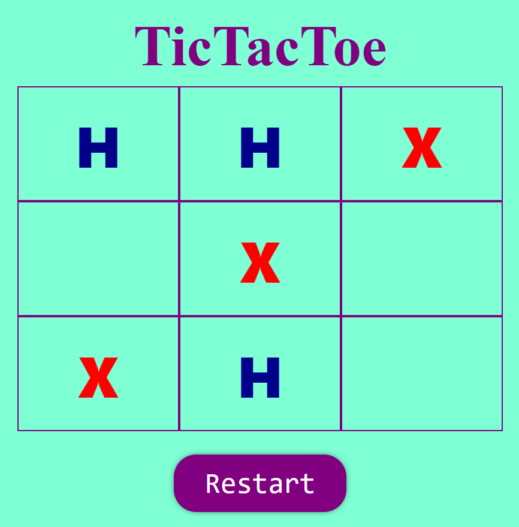
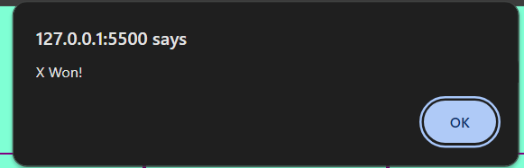

<h1>TicTacToe Using HTML, CSS, Bootstrap and JavaScript</h1>

    
    

Exciting news, everyone! I'm thrilled to announce the launch of my new GitHub repository featuring a captivating game built using HTML, CSS, Bootstrap, and JavaScript! 🌟

👉 Are you ready to embark on a journey of fun and excitement? Explore the thrilling world of [Game Name] where every move counts and every level presents new challenges.

🚀 Developed with HTML for structure, CSS for styling, Bootstrap for responsiveness, and JavaScript for dynamic gameplay, this game is not only entertaining but also a great learning resource for aspiring developers.

🔍 Dive into the code, dissect the logic, and discover how simple JavaScript functions bring this game to life. Whether you're a seasoned developer or just starting your coding journey, this project offers valuable insights and practical lessons.

💡 Use this project to hone your coding skills, experiment with new techniques, or simply enjoy some leisure time with an engaging game. Feel free to fork, contribute, and customize to your heart's content!

Ready to level up your coding skills? Visit my GitHub repository and start playing today! 🎉👾

